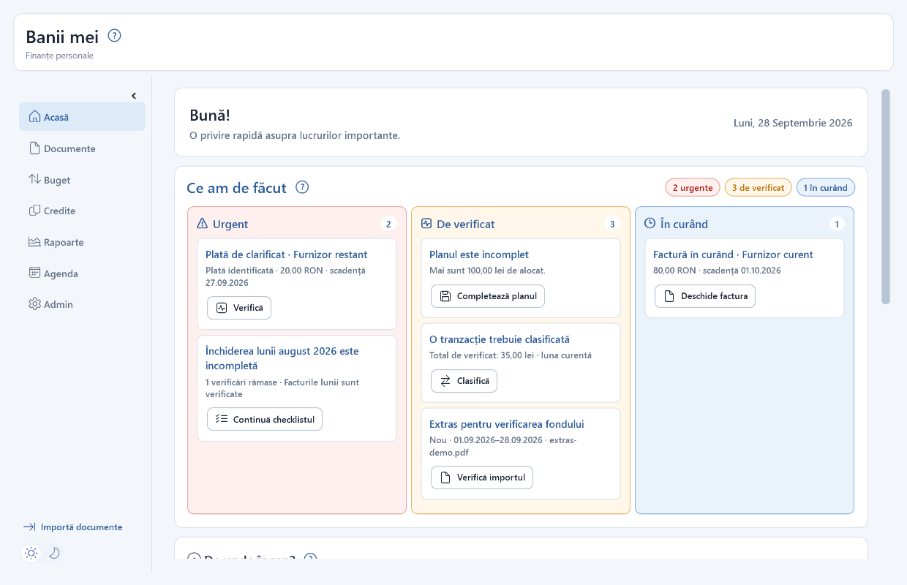
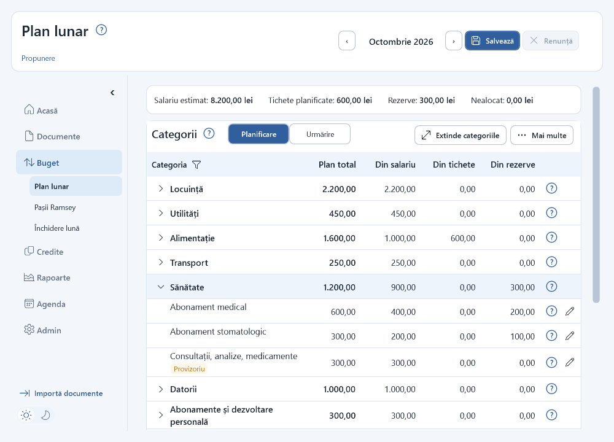
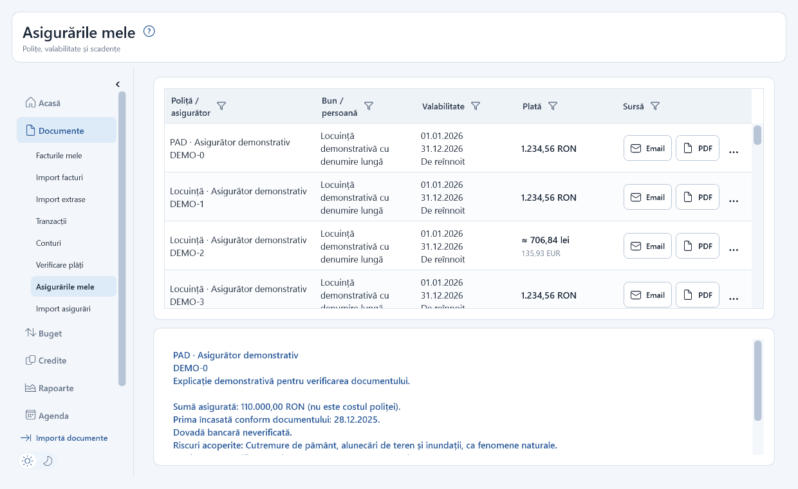
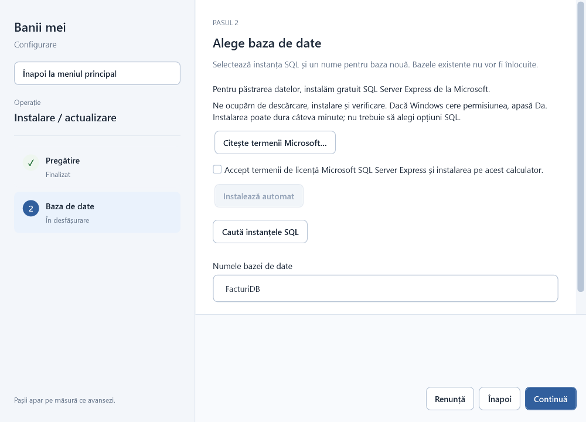
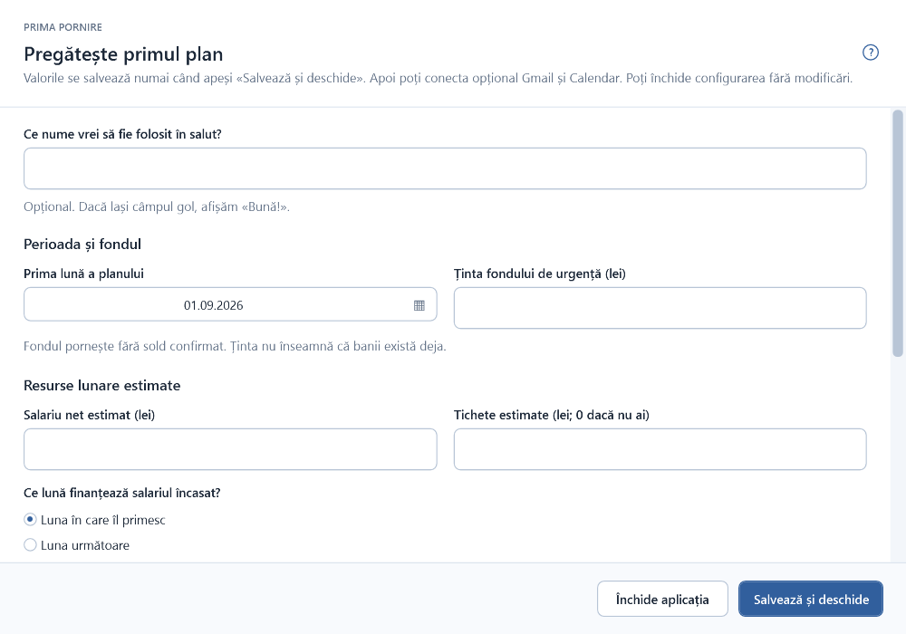

# Banii mei

O aplicație Windows pentru organizarea finanțelor personale: buget, facturi, extrase de cont, credite și asigurări într-un singur loc. Creată cu ❤️ de Cristina Richter.

[Descoperă aplicația și ghidul pentru prima instalare](https://cristinarichter1.github.io/banii-mei/)

> **Stadiu:** [cea mai recentă versiune pentru Windows](https://github.com/CristinaRichter1/banii-mei/releases) este disponibilă pentru testare. Nu este încă o versiune stabilă pentru utilizarea zilnică. Linkul include și versiunile beta; descarcă pachetul Windows din primul release publicat.

## Ce poți face

- Planifici bugetul lunar pe categorii și urmărești separat estimările și plățile efectuate.
- Organizezi facturi, extrase, tranzacții și verificarea plăților.
- Urmărești credite și asigurări, inclusiv scadențe și repere de reînnoire.
- Alegi dacă vrei să conectezi Gmail și Calendar; acestea nu sunt necesare pentru configurarea inițială.

## Documente recunoscute automat

Citirea depinde de formatul documentului, nu doar de numele instituției. În versiunea beta sunt implementate:

| Tip | Instituție / document | Format acoperit |
| --- | --- | --- |
| Extras bancar | ING Bank | Extrase PDF ING recunoscute de cititorul aplicației |
| Extras bancar | BRD | Extrase PDF BRD recunoscute de cititorul aplicației |
| Extras bancar | Banca Transilvania (BT) | Extrase PDF BT recunoscute de cititorul aplicației |
| Asigurare | PAID | Polița PAD pentru locuință |
| Asigurare | Sogessur / BRD Asigurări | Certificatul de asigurare facultativă a locuinței în formatul BRD recunoscut |
| Asigurare | Allianz-Țiriac | Polița individuală de sănătate SanaPro în formatul recunoscut |

Ofertele, notificările și condițiile de asigurare nu sunt importate automat ca polițe. Un PDF cu altă structură, chiar de la una dintre instituțiile de mai sus, poate necesita verificare sau poate fi respins. Aplicația nu presupune valori lipsă din document.

## Cum arată

Capturile sunt din versiunea de dezvoltare, cu date demonstrative. Nu conțin documente sau valori financiare personale; interfața se poate schimba până la lansare.

### Acasă — ce merită atenție

Pagina Acasă grupează lucrurile de rezolvat, fără să confirme automat plăți sau importuri.

### Plan lunar — categorii și surse

Planul arată separat ce aloci din salariu, din tichete și din rezerve. Valorile din imagine sunt fictive.

### Asigurări — polițe și riscuri

Detaliile unei polițe pot arăta valabilitatea, prima și riscurile citite din document, fără a confunda acestea cu o plată bancară verificată.

### Configurarea inițială

Configuratorul te conduce prin pregătirea instalării și a bazei de date.

La prima pornire poți alege numele folosit în salut, luna de început și resursele estimate pentru primul plan.

## Prima instalare

Aplicația este destinată Windows x64. Descarcă [pachetul beta din secțiunea Releases](https://github.com/CristinaRichter1/banii-mei/releases), dezarhivează-l și pornește „Instaleaza Banii mei.exe”. Pachetul este pentru testare și nu este semnat digital; Windows poate afișa un avertisment privind editorul necunoscut. Nu instala fișiere din alte surse. [Ghidul primei instalări](https://cristinarichter1.github.io/banii-mei/#instalare) explică pașii.

Dacă testezi deja aplicația cu un pachet primit direct, păstrează toate fișierele pachetului împreună și urmează pașii afișați de configurator. Pentru mutarea datelor de pe alt calculator, folosește opțiunea de restaurare dintr-o copie de rezervă creată de „Banii mei”; nu șterge originalul înainte de a verifica restaurarea.

## Date și confidențialitate

Datele aplicației se păstrează într-o bază locală. Conectarea la Gmail și Calendar este opțională și se configurează separat. Această pagină și acest depozit GitHub nu solicită documentele tale financiare.

**Nu publica** extrase, facturi, polițe, IBAN-uri, CNP-uri, parole, copii ale bazei de date sau jurnale complete. Ascunde datele personale și financiare din capturi înainte de a le trimite.

## Contact și ajutor

- [Întrebări și sugestii — Discussions](https://github.com/CristinaRichter1/banii-mei/discussions)
- [Raportează o problemă — Issues](https://github.com/CristinaRichter1/banii-mei/issues)

Pentru a scrie ai nevoie de un cont GitHub. Mesajele și răspunsurile sunt publice, nu private. Când raportezi o problemă, spune ce versiune folosești, ce pași ai urmat, ce te așteptai să se întâmple și ce s-a întâmplat efectiv.

Acest depozit este pentru prezentare și comunicarea cu utilizatorii. Codul aplicației și datele financiare nu sunt publicate aici.

[GitHub](https://github.com/CristinaRichter1) · [LinkedIn](https://www.linkedin.com/in/cristina-richter/)
